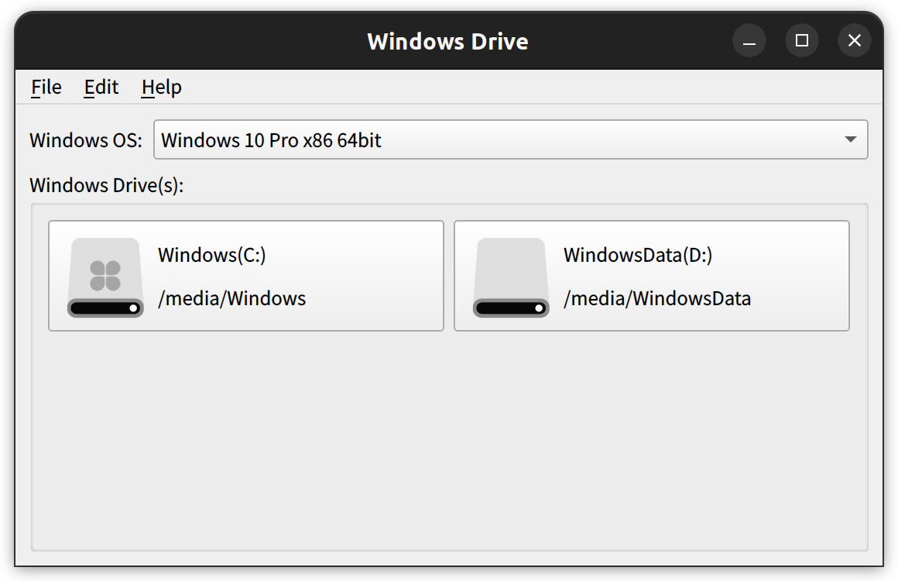

## WindowsDrive
   A helper for Linux user to show Windows(if installed) Drive Letter for local disk(s)

## Download
   Ubuntu/Debian: [x86_64](https://windows-drive.weiketing.com/downloads) 
   macOS: [x86_64](https://windows-drive.weiketing.com/downloads)

## Screenshot

